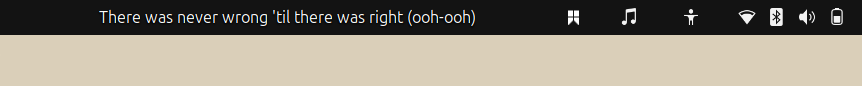
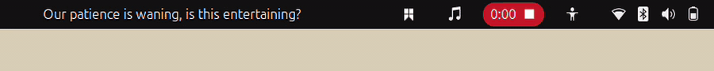

# LyricBar

LyricBar is a GNOME Shell extension that displays synchronized live lyrics in the top bar for Spotify and other MPRIS-compatible music players.

It is built for GNOME Shell 46-49, with Spotify Desktop as the primary target. Lyrics are fetched from LRCLIB, cached locally, and rendered as a single glanceable line in the panel.





## Features

- Synced one-line lyric display in the GNOME top bar.
- Spotify-first MPRIS player selection with configurable player priority.
- LRCLIB synced lyric lookup with local cache.
- Fallback modes for tracks without synced lyrics.
- Preferences for panel position, maximum width, text alignment, fallback behavior, cache, player priority, and debug logging.
- Small panel menu for quick position/alignment changes and preferences access.
- Strict local harness: formatting, linting, type checking, architecture checks, unit tests, schema validation, and bundle build.

## Compatibility

| Target              | Status         |
| ------------------- | -------------- |
| GNOME Shell 46-49   | Supported      |
| Ubuntu 24.04        | Supported      |
| Fedora GNOME        | Supported      |
| Spotify Desktop     | Primary target |
| Other MPRIS players | Best effort    |

Broader GNOME Shell versions should be added only after runtime testing. GNOME Shell extension APIs are not stable enough for blanket compatibility claims.

## Install

Run:

```bash
curl -fsSL https://raw.githubusercontent.com/fikrilal/gnome-lyricbar/main/scripts/install.sh | bash
```

Open preferences:

```bash
gnome-extensions prefs lyricbar@fikrilal.github.io
```

Uninstall:

```bash
gnome-extensions disable lyricbar@fikrilal.github.io
rm -rf ~/.local/share/gnome-shell/extensions/lyricbar@fikrilal.github.io
```

## Development

Requirements:

- GNOME Shell 46-49
- Node.js 22+
- `glib-compile-schemas`
- `zip`

Build and install:

```bash
npm ci
npm run verify
gnome-extensions install --force dist/lyricbar@fikrilal.github.io.zip
gnome-extensions enable lyricbar@fikrilal.github.io
```

The generated bundle is written to `dist/lyricbar@fikrilal.github.io.zip`.

## Privacy

LyricBar does not use telemetry and does not require a Spotify account. For lyric lookup, it sends track metadata such as artist, title, album, and duration to LRCLIB. See [Privacy](docs/privacy.md).

## Troubleshooting

If the panel is blank, lyrics do not sync, or the wrong player is selected, see [Troubleshooting](docs/troubleshooting.md).

## Documentation

- [Product overview](docs/product.md)
- [Engineering proposal](docs/engineering-proposal.md)
- [Agent harness](docs/harness/agent-harness.md)
- [Runtime evidence workflow](docs/harness/runtime-evidence.md)
- [Release checklist](docs/release-checklist.md)

## License

MIT
